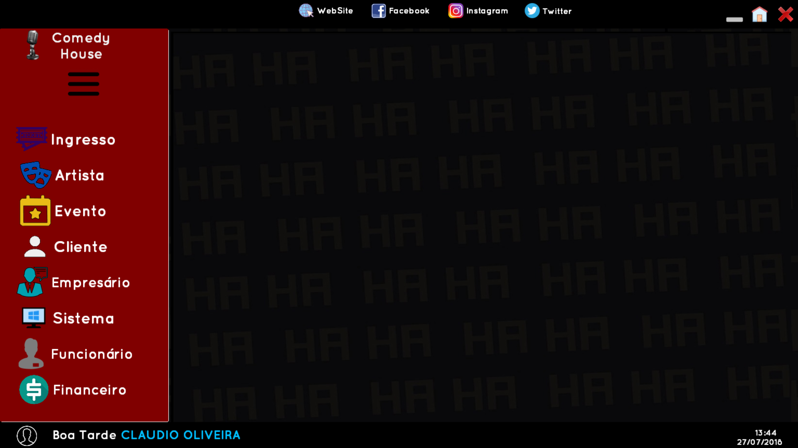
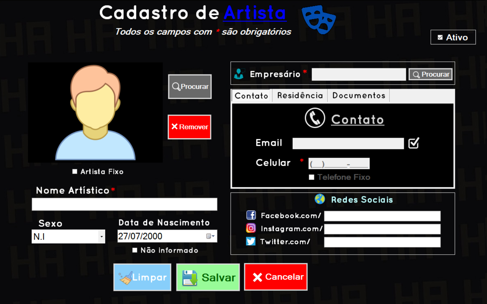
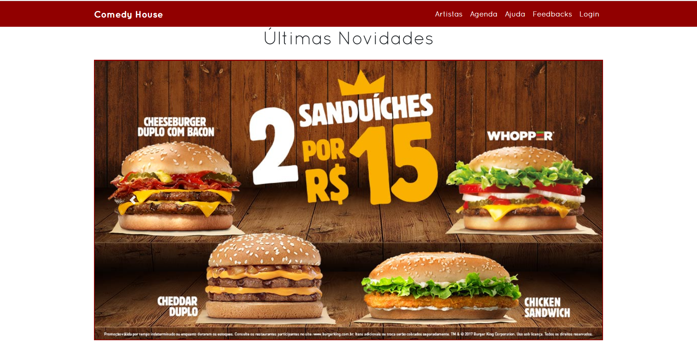
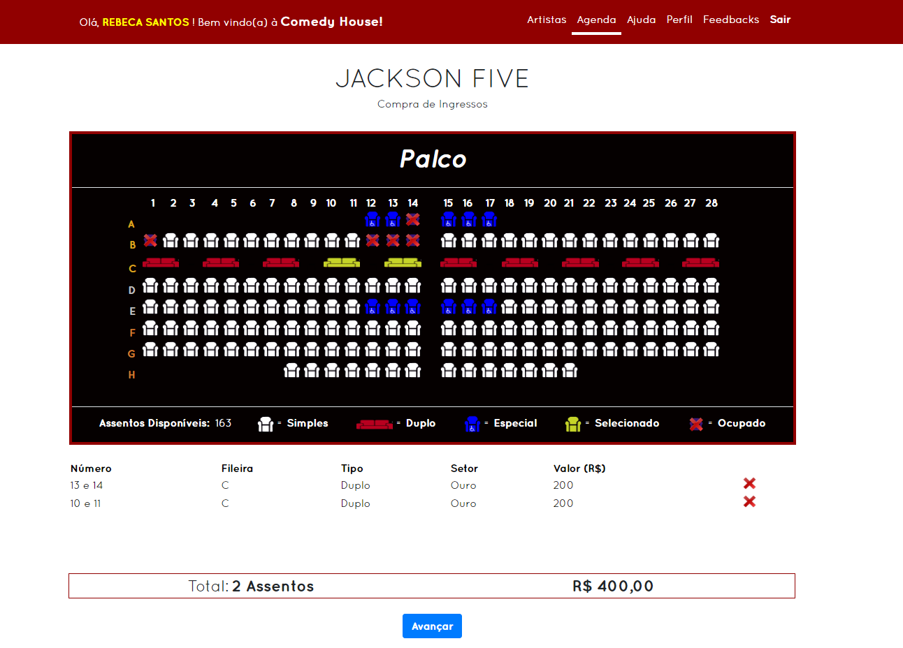
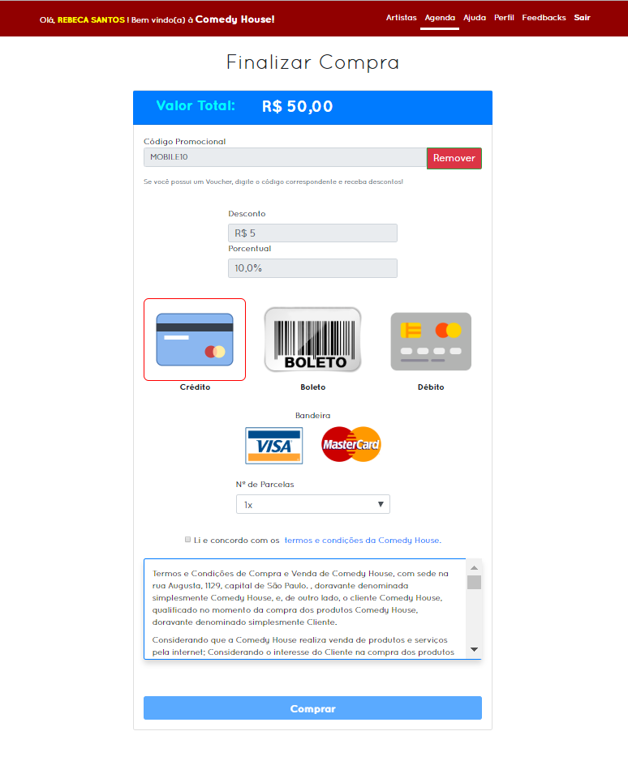

# 🎙 COMEDY HOUSE 🎙

##### CASA DE SHOWS DE STAND-UP 
O projeto envolve a criação de um sistema Desktop para gerenciamento de uma casa de shows, um Website e um aplicativo Mobile para a divulgação e interação da mesma para com os seus clientes. Após um longo processo de decisão, o grupo decidiu, em consenso, o tema Casa de Shows por este ser pouco comum e algo que todos da equipe possuíssem conhecimento e tivessem interesse.  Pesquisas indicam que há muita perda de informação com o uso de papéis no gerenciamento dos estabelecimentos, por isso fomos contratados para ajudar na criação e modernização da Comedy House, que busca seu espaço competindo com outros locais de grande porte.

[Documentação do projeto](https://github.com/LucasCancio/TCC-Show/blob/master/TCC-DOCUMENTOS/TCC_STANDUP_%20GERAL.pdf)

### 👨‍🎓 Integrantes
- Arthur Porto Silva
- Diego Gomes Nogueira da Silva
- [Gabriel Leandro Santos Sousa](https://github.com/gabrielleandro0801)
- [Lucas Camargo Cancio](https://github.com/LucasCancio)
- Marcos Vinicius dos Santos Pereira

### ⚡ Tecnologias usadas
Linguagens de programação: 
- C#
- ASP.NET
- JAVA
- SQL
- HTML/CSS
- Javascript
- AJAX

Programas:
- Visual Studio 2017
- Android Studio
- Oracle
- SQL Server 2017
------------
##### O que foi desenvolvido em cada parte do projeto:

### 🖥 Sistema Corporativo
É a ferramenta para o cliente gerenciar a empresa, ou seja, controlar a entrada e saída de informações sobre os cadastros (clientes, funcionários), pagamentos, os agendamentos da casa de show.

<b align="center">Pequeno resumo sobre o sistema corporativo: https://youtu.be/IuC0VFbY4CI</b>

### 🌍 Web Site
Será o centro de publicidade do projeto, ou seja, nele será mostrado as informações do show (preço e horário) e será possível o cadastro do usuário para então, o mesmo poder efetuar a compra virtual dos ingressos, escolhendo assento, tipo de assento e classificação.

### 📱 Aplicativo móvel (mobile)
No aplicativo móvel o usuário cadastrado, poderá consultar todos os futuros eventos da casa de show e os eventos do dia, poderá também consultar seu histórico de compras, e o usuário também fará o uso do QRCode.

  
  
  
 

 
 
### ❤ Agradecimentos
 
Primeiramente a Deus, pois sem ele não teríamos chegado até aqui. Aos nossos familiares, por sempre terem nos aconselhado e ajudado quando precisamos. À todos os professores técnicos, por terem sempre nos ajudado com as dúvidas e problemas, além de terem nos dado a devida atenção quando precisamos. Aos profissionais técnicos da instituição, por terem nos auxiliado com o fluxo de arquivos requisitados. Aos nossos colegas de classe, por terem dado dicas, auxílio e informações que foram essenciais para a realização do projeto. Ao ITB, pela oportunidade de aprendizado. Nossos sinceros agradecimentos. 
